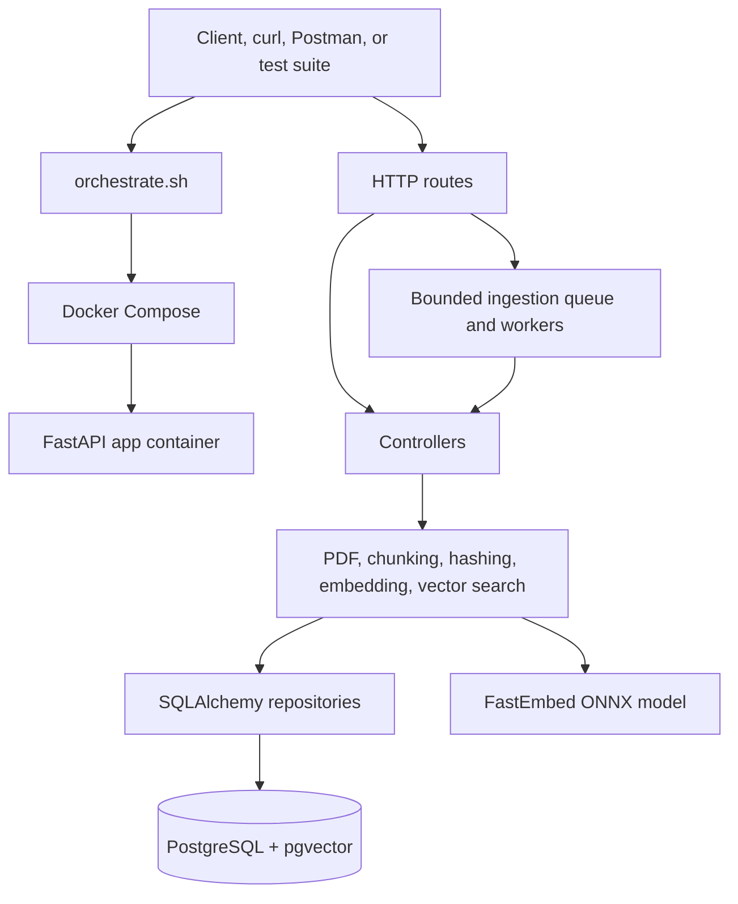

# PDF Ingestion & Semantic Search API

A containerised microservice that ingests PDF documents, generates vector embeddings with FastEmbed, stores them in PostgreSQL with [pgvector](https://github.com/pgvector/pgvector), and exposes a hybrid semantic and keyword search endpoint.

---

## Architecture


The application uses a layered flow:

```text
HTTP request
  -> route validation and dependency injection
  -> ingestion job queue (for PDF ingestion)
  -> controller orchestration (worker)
  -> domain/service processing
  -> repository database operation
  -> response schema
  -> HTTP response
```


| Component  | Purpose                                          |
|------------|--------------------------------------------------|
| **FastAPI** | REST API — ingest PDFs, semantic search          |
| **FastEmbed** | In-process `BAAI/bge-small-en-v1.5` model (384-dim) |
| **PostgreSQL + pgvector** | Document & chunk storage with hybrid vector and full-text search |
| **Alembic** | Database schema migrations                       |

---

## Project Structure

```
brightskies/
├── orchestrate.sh             # Start / terminate the full stack
├── init-db.sh                 # PostgreSQL init script (pgvector + pgcrypto)
├── swagger.yaml               # OpenAPI 3.0 specification
├── readme.md                  # This file
├── DOCUMENTATION.md           # Detailed system design & architecture docs
├── docker/
│   ├── Docker-compose.yml     # Service definitions (app, postgres)
│   ├── Dockerfile             # App container build
│   ├── .env.example           # Environment variable template (copy to .env)
│   ├── .gitignore             # Excludes .env from version control
│   ├── requirements.txt       # Python dependencies
│   └── data/                  # Mounted volume for directory-based ingestion
├── src/
│   ├── main.py                # FastAPI app entry point & lifespan
│   ├── database.py            # Async DB session dependency
│   ├── exceptions.py          # Custom exception classes
│   ├── .env.example           # Local dev environment template
│   ├── helpers/
│   │   └── config.py          # Pydantic Settings (env-driven config)
│   ├── routes/
│   │   ├── base.py            # GET /api/v1/ — health / welcome
│   │   ├── ingest.py          # POST /api/v1/ingest/ — PDF ingestion
│   │   ├── search.py          # POST /api/v1/search/ — semantic search
│   │   └── schemas/           # Pydantic request/response models
│   ├── controllers/
│   │   ├── ingest_controller.py   # Ingestion orchestration logic
│   │   └── search_controller.py   # Search orchestration logic
│   ├── services/
    │   │   ├── ingestion_worker.py # Bounded background ingestion queue
│   │   ├── pdf_extractor.py       # PDF text extraction (PyMuPDF)
│   │   ├── chunker.py             # Text chunking (langchain splitters)
│   │   ├── hashing.py             # SHA-256 deduplication
│   │   ├── vector_search.py       # pgvector similarity search
│   │   └── embedding/             # Embedding provider abstraction
│   │       ├── EmbeddingInterface.py
│   │       ├── EmbeddingProviderFactory.py
│   │       └── providers/
│   │           └── local_provider.py  # FastEmbed-backed embeddings
│   ├── repositories/
│   │   ├── document_repository.py  # Document CRUD
│   │   └── chunk_repository.py     # Chunk CRUD + hybrid search
│   └── models/
│       └── db_scheme/pgvector/
│           ├── schemes/            # SQLAlchemy ORM models
│           │   ├── documents.py
│           │   └── chunk.py
│           ├── alembic.ini
│           └── alembic/            # Migration scripts
├── evaluation/
│   ├── ragas_benchmark.py     # Performance & retrieval quality benchmark
│   └── sample.jsonl           # Sample benchmark dataset
└── test/
    └── suite.py               # Pytest functional test suite
```

---

## Getting Started (A–Z Setup Guide)

This section walks you through setting up and running the entire system from scratch.

### Prerequisites

| Requirement | Version |
|---|---|
| **Docker** | ≥ 20.x |
| **Docker Compose** | ≥ 2.x |
| **Free ports** | `8000` (API) and `5432` (PostgreSQL) |

> **Note:** Python is only needed on your host machine if you want to run the tests or the benchmark script locally. The application itself runs entirely inside Docker containers.

---

### Step 1: Clone the Repository

```bash
git clone <your-repo-url>
cd brightskies
```

---

### Step 2: Configure Environment Variables

The application uses environment variables for all configuration. Two `.env.example` template files are provided
 you must copy and edit to create your own `.env` files. and put the uncommented values in the `.env` file. The `.env` file is **not** checked into version control.

#### A) Docker Environment (Required)

This is the main configuration used when running with Docker.

```bash
# Copy the template
cp docker/.env.example docker/.env
```

Now edit `docker/.env` and fill in the **required** fields:

```env
# ┌───────────────────────────────────────────────────────────┐
# │  REQUIRED — You MUST set these                           │
# └───────────────────────────────────────────────────────────┘
POSTGRES_USER=raguser              # PostgreSQL username
POSTGRES_PASSWORD=your_password    # ⚠️  Choose a strong password
POSTGRES_DB=ragdb                  # Database name (used by Docker)
POSTGRES_DATABASE=ragdb            # Database name (used by the app — must match POSTGRES_DB)

# ┌───────────────────────────────────────────────────────────┐
# │  OPTIONAL — Defaults are usually fine                    │
# └───────────────────────────────────────────────────────────┘
POSTGRES_HOST=postgres             # Container hostname (don't change for Docker)
POSTGRES_PORT=5432                 # PostgreSQL port

APP_NAME=BrightSkies               # Application name
APP_VERSION=1.0.0                  # Application version

EMBEDDING_BACKEND=LOCAL            # Embedding provider (only LOCAL is supported)
EMBEDDING_MODEL_ID=BAAI/bge-small-en-v1.5  # FastEmbed model
EMBEDDING_MODEL_SIZE=384           # Embedding vector dimensions
INGESTION_WORKERS=1                # Background ingestion workers per process
INGESTION_QUEUE_SIZE=100            # Maximum queued files per process

CHUNK_SIZE=1000                    # Max characters per text chunk
CHUNK_OVERLAP=50                  # Overlap between adjacent chunks

TOP_K=5                            # Number of search results to return
HYBRID_RRF_K=60                    # Reciprocal Rank Fusion constant
MIN_RELEVANCE_SCORE=0.55           # Minimum semantic similarity threshold

ALLOWED_DIRECTORY=/data            # Base directory for directory ingestion
```

> **⚠️ Important:** `POSTGRES_DB` and `POSTGRES_DATABASE` **must have the same value**. `POSTGRES_DB` is used by the PostgreSQL container to create the database, while `POSTGRES_DATABASE` is used by the app to connect to it.

#### B) Local Development Environment (Optional)

Only needed if you want to run the FastAPI app directly on your host (outside Docker):

```bash
cp src/.env.example src/.env
# Edit src/.env with your local PostgreSQL connection details
```

---

### Step 3: Start the Stack

```bash
chmod +x orchestrate.sh
./orchestrate.sh --action start
```

This will:
1. Build the Docker images (app + PostgreSQL with pgvector).
2. Start PostgreSQL and wait for it to become healthy.
3. Download and cache the `BAAI/bge-small-en-v1.5` embedding model on first startup (~30MB).
4. Run Alembic database migrations to create the schema.
5. Start the FastAPI server on `http://localhost:8000`.

PDF ingestion is handled by a bounded in-process queue. The API returns after
the files are queued, while background workers extract, embed, and persist each
file. Set `INGESTION_WORKERS=1` for large local embedding models unless memory
and inference benchmarks justify a higher value.

The queue is local to one application process. With multiple replicas or
server workers, each process has its own queue and model instance, so total
embedding concurrency is approximately `replicas × processes × INGESTION_WORKERS`.
Queued files are held in memory and are lost if the process stops before they
are processed; use a durable broker such as Redis, RabbitMQ, or Azure Service
Bus for multi-replica production workloads.

The script polls `http://localhost:8000/docs` and exits once the service is ready (or times out after ~5 minutes).

> **First run note:** The initial startup may take a few minutes while Docker downloads images and the embedding model is cached. Subsequent startups are much faster.

---

### Step 4: Verify the Service

Once the stack is running, verify it's working:

```bash
# Check the welcome endpoint
curl http://localhost:8000/api/v1/

# Open the Swagger UI in your browser
open http://localhost:8000/docs
```

---

### Step 5: Ingest PDF Documents

You can ingest PDFs in three ways:

#### Single File

```bash
curl -X POST http://localhost:8000/api/v1/ingest/ \
  -F "input=@/path/to/document.pdf"
```

#### Multiple Files

```bash
curl -X POST http://localhost:8000/api/v1/ingest/ \
  -F "input=@doc1.pdf" \
  -F "input=@doc2.pdf"
```

#### Directory (Container Path)

Place PDF files in `docker/data/`, then:

```bash
curl -X POST http://localhost:8000/api/v1/ingest/ \
  -F "input=/data"
```

> The directory path must be inside the container's `/data` mount. Files placed in `docker/data/` on the host are accessible as `/data/` inside the container.

#### Ingestion Response

```json
{
  "message": "Queued 2 PDF document(s) for ingestion.",
  "files": ["doc1.pdf", "doc2.pdf"]
}
```

The response confirms that the files were accepted by the queue. Processing
continues in the background; the `documents` table records `processing`,
`completed`, or `failed` status for each file.

---

### Step 6: Search Ingested Documents

```bash
curl -X POST http://localhost:8000/api/v1/search/ \
  -H "Content-Type: application/json" \
  -d '{"query": "How does machine learning work?"}'
```

#### Search Response

```json
{
  "results": [
    {
      "document": "doc1.pdf",
      "score": 0.89,
      "content": "Vector embeddings represent text in a numerical space..."
    }
  ]
}
```

> Convenience aliases without the `/api/v1` prefix are also available: `POST /ingest/` and `POST /search/`.

---

### Step 7: Run Tests

The test suite requires a running service and uses `pytest` + `requests`:

```bash
# Install test dependencies (on your host)
pip install pytest requests

# Run the full test suite
pytest test/suite.py -v
```

The test suite (13 tests) covers:
- Service health checks
- Single and multiple PDF ingestion
- Duplicate detection
- Semantic search queries
- Edge cases (invalid files, empty queries, concurrent uploads)

---

### Step 8: Run Benchmarks (Optional)

For performance and retrieval-quality evaluation:

```bash
# Performance-only (no Ragas metrics)
python evaluation/ragas_benchmark.py \
  --dataset evaluation/sample.jsonl \
  --concurrency 4 \
  --skip-ragas

# With Ragas evaluation (requires ragas package)
python evaluation/ragas_benchmark.py \
  --dataset evaluation/sample.jsonl \
  --concurrency 4 \
  --output evaluation/report.json
```

> **Note:** You should create your own `evaluation/sample.jsonl` with ground-truth data based on the PDFs you've actually ingested. The included sample is a minimal placeholder.

---

### Step 9: Stop the Stack

```bash
./orchestrate.sh --action terminate
```

This stops the containers while **preserving** indexed data and the cached embedding model.

To **completely remove** all persisted data (database, cached models):

```bash
docker compose -f docker/Docker-compose.yml down -v
```

---

## API Reference

| Method | Endpoint              | Description                      |
|--------|-----------------------|----------------------------------|
| GET    | `/api/v1/`            | Health check / welcome           |
| POST   | `/api/v1/ingest/`     | Ingest PDF file(s) or directory  |
| POST   | `/api/v1/search/`     | Semantic search over ingested docs |
| GET    | `/docs`               | Swagger UI (auto-generated)      |

Full OpenAPI spec: [`swagger.yaml`](swagger.yaml)

---

## Edge Case Handling

| Scenario               | Behaviour                                            |
|------------------------|------------------------------------------------------|
| Non-PDF file uploaded  | `400` — "Only PDF files are accepted."               |
| Empty / whitespace query | `400` — "Query cannot be empty."                   |
| Duplicate PDF          | Detected by SHA-256 hash; returns success with note  |
| Image-only PDF         | `400` — "Could not extract any text from the file."  |
| Invalid directory path | `400` — path traversal protection enforced           |
| Embedding failure      | Logged; document status is set to `failed`            |
| Concurrent uploads     | Handled by bounded background workers                |

---

## Configuration Reference

All settings are driven by environment variables (see [`docker/.env.example`](docker/.env.example)):

| Variable             | Required | Default       | Description                          |
|----------------------|----------|---------------|--------------------------------------|
| `POSTGRES_USER`      | ✅       | —             | PostgreSQL username                  |
| `POSTGRES_PASSWORD`  | ✅       | —             | PostgreSQL password                  |
| `POSTGRES_DB`        | ✅       | —             | Database name (Docker container)     |
| `POSTGRES_HOST`      | —        | `postgres`    | PostgreSQL host                      |
| `POSTGRES_PORT`      | —        | `5432`        | PostgreSQL port                      |
| `POSTGRES_DATABASE`  | ✅       | —             | Database name (app connection)       |
| `APP_NAME`           | —        | `BrightSkies` | Application display name             |
| `APP_VERSION`        | —        | `1.0.0`       | Application version                  |
| `EMBEDDING_BACKEND`  | —        | `LOCAL`       | Embedding provider                   |
| `EMBEDDING_MODEL_ID` | —        | `BAAI/bge-small-en-v1.5` | FastEmbed model for embeddings |
| `EMBEDDING_MODEL_SIZE` | —      | `384`         | Embedding vector dimensions          |
| `INGESTION_WORKERS`   | —        | `1`         | Background workers per application process |
| `INGESTION_QUEUE_SIZE`| —        | `100`       | Maximum queued files per application process |
| `CHUNK_SIZE`         | —        | `1000`        | Max characters per text chunk        |
| `CHUNK_OVERLAP`      | —        | `50`         | Overlap between adjacent chunks      |
| `TOP_K`              | —        | `5`           | Number of search results to return   |
| `HYBRID_RRF_K`       | —        | `60`          | Reciprocal Rank Fusion constant      |
| `MIN_RELEVANCE_SCORE`| —        | `0.55`        | Minimum semantic similarity threshold|
| `ALLOWED_DIRECTORY`  | —        | `/data`       | Base directory for directory ingestion |

---

## Dependencies

The application runs inside Docker and installs the following Python packages (see [`docker/requirements.txt`](docker/requirements.txt)):

| Package | Purpose |
|---------|---------|
| `fastapi[standard]` | Web framework and API server |
| `uvicorn[standard]` | ASGI server to run FastAPI |
| `sqlalchemy[asyncio]` | Async ORM for database operations |
| `asyncpg` | PostgreSQL async driver |
| `alembic` | Database schema migrations |
| `pgvector` | pgvector SQLAlchemy support |
| `psycopg2-binary` | PostgreSQL adapter (used by Alembic) |
| `PyMuPDF` | PDF text extraction |
| `langchain-text-splitters` | Text chunking with RecursiveCharacterTextSplitter |
| `fastembed` | Local embedding model inference (ONNX) |
| `pydantic-settings` | Environment-driven configuration |
| `python-multipart` | File upload parsing |
| `ragas` | Retrieval evaluation metrics (optional) |
| `requests` | HTTP client (for benchmarks and tests) |

---

## Hybrid Search

Search combines two PostgreSQL retrieval signals:

- pgvector cosine-distance ranking for semantic similarity.
- PostgreSQL English full-text ranking for exact terms and phrases.

The two candidate rankings are combined with Reciprocal Rank Fusion. The
`HYBRID_RRF_K` setting controls the fusion constant and defaults to `60`.
Hybrid retrieval improves ranking, but it does not by itself prove that a
question is in scope. A production policy should also apply a calibrated
minimum relevance threshold and return an explicit no-relevant-document result
when the evidence is weak.

---

## Ragas And Performance Evaluation

Request logs include the HTTP method, path, status, and `latency_ms`. For
retrieval-quality evaluation and throughput measurements, install the optional
evaluation dependencies (note: you must put your own sample data in `evaluation/sample.jsonl` based on the pdfs you have ingested and the expected results for those pdfs):

```bash
python evaluation/ragas_benchmark.py \
  --dataset evaluation/sample.jsonl \
  --concurrency 4 \
  --output evaluation/report.json
```

The benchmark sends concurrent search requests and reports wall-clock
throughput, minimum/mean/median/p95/maximum latency, each response, and Ragas
context precision and context recall. It prints the report and writes it to
`evaluation/report.json`.

For performance-only measurements without installing Ragas metrics:

```bash
python evaluation/ragas_benchmark.py \
  --dataset evaluation/sample.jsonl \
  --concurrency 4 \
  --skip-ragas
```

